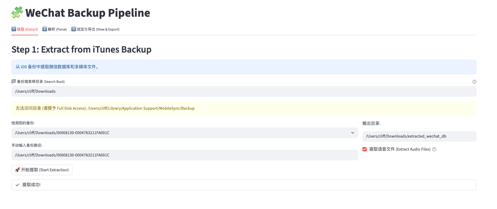
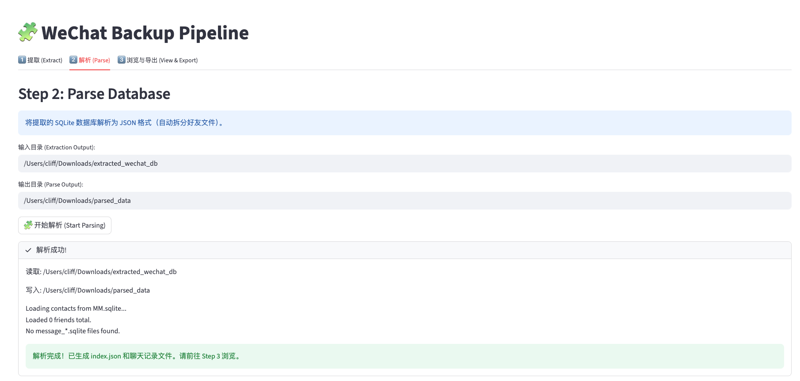
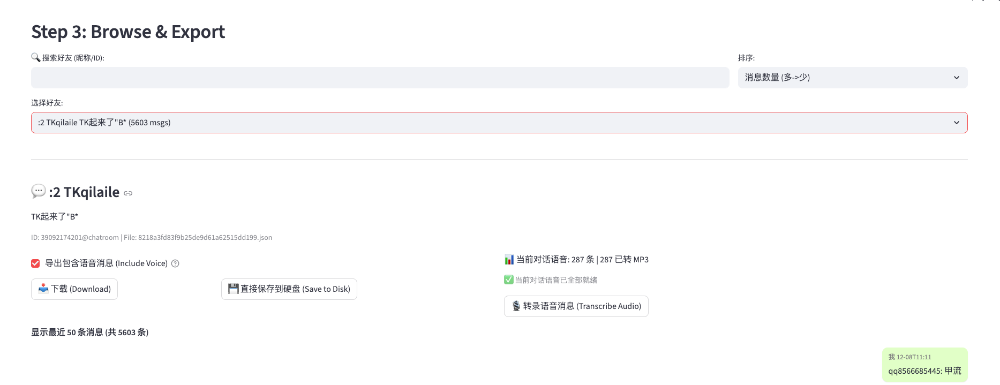

# wechat-back-up-export

[](LICENSE)

[English](#english) | [中文](#chinese)

<a name="english"></a>
## 🇺🇸 English

**wechat-back-up-export** is a local toolset designed to help you export and browse WeChat chat history from iOS iTunes backups.

**Supported Platform**: macOS 🍎

It provides a Streamlit-based visual interface that supports:
*   🚀 **Extract**: Lossless extraction of WeChat database (`MM.sqlite`) and media resources from unencrypted iOS backups.
*   🧩 **Parse**: Parse complex SQLite databases into readable JSON format, automatically archived by friend/group chat.
*   💬 **View & Export**: A message browsing interface similar to WeChat PC, supporting **Voice-to-Text (Whisper)**, and exporting chat history to readable JSON files.

> ⚠️ **Privacy Warning**: The data handled by this project is extremely sensitive. All operations are performed **locally**, and no data will be uploaded. Please ensure the security of your device.

---

### ✨ Features

- **One-stop Pipeline**: No complex command lines, UI guides through the full process.
- **Smart Path Management**: Automatically identifies iTunes backup paths and manages output directories.
- **Voice-to-Text**: Integrated OpenAI Whisper model (running locally) to transcribe WeChat voice messages to text.
- **Audio Conversion**: Built-in `silk-v3-decoder` to automatically convert WeChat's `.aud/.silk` audio to common `.mp3`.
- **Secure Export**: Supports exporting full chat history with transcribed text to JSON, providing a "Save directly to disk" function to bypass macOS file quarantine.

---

### 🛠️ Installation

#### 1. Requirements

*   **Python 3.10+**
*   **macOS** (Tested primarily on macOS, supports iOS auto-discovery)
*   **FFmpeg** (For audio conversion)

```bash
# Install FFmpeg on macOS
brew install ffmpeg
```

#### 2. Clone & Install Dependencies

```bash
git clone git@github.com:cliff-personal/wechat-back-up-export.git
cd wechat-back-up-export

# Create virtual environment (Recommended)
python3 -m venv .venv
source .venv/bin/activate

# Install dependencies
pip install -r src/back_up_read/requirements_ui.txt
```

---

### 🚀 Usage

Start the UI:

```bash
streamlit run src/back_up_read/pipeline_ui.py
```

Browser will open `http://localhost:8501`.

#### Step 1: Extract
1. The tool scans `~/Library/Application Support/MobileSync/Backup`.
2. Enter custom path in **"Search Root"** if backups are elsewhere.
3. Select the backup folder.
4. Check **"Extract Audio Files"** (Recommended).
5. Click **"🚀 Start Extraction"**.

#### Step 2: Parse
1. Switch to **Step 2**.
2. Confirm input directory (defaults to previous step's output).
3. Click **"🧩 Start Parsing"**.
4. Reads `WCDB_Contact.sqlite` (contacts) and `message_*.sqlite` (chats).

#### Step 3: Browse & Export
1. Switch to **Step 3**.
2. Search friend by Name or ID.
3. Select chat.
4. **Audio**:
    *   **Convert**: Click **"🔄 Convert"** if needed.
    *   **Transcribe**: Click **"🎙️ Transcribe"** to use Whisper. Output appears in bubble.
5. **Export**:
    *   Click **"💾 Save to Disk"** to save JSON with transcripts.

---

### 📂 Directory Structure

```text
wechat-back-up-export/
├── src/
│   └── back_up_read/
│       ├── pipeline_ui.py      # UI Entry Point
│       ├── extract_wechat.py   # Extraction Script
│       ├── parse_db.py         # Parsing Script
│       ├── transcribe_audio.py # Whisper Script
│       └── silk-v3-decoder/    # Audio Decoder
├── logs/                       # Logs
└── doc/                        # Images
```

---

### ❓ FAQ

**Q: "Permission Denied" when reading backups?**
A: macOS restricts `~/Library/`. Grant **"Full Disk Access"** to Terminal/VSCode in System Settings -> Privacy & Security.

**Q: Friend list empty after parsing?**
A: Ensure extraction ran successfully. New iOS WeChat versions split data across `WCDB_Contact.sqlite` and `message_*.sqlite`.

**Q: "Apple could not verify..." when opening exported JSON?**
A: Use the **"💾 Save to Disk"** button in the UI instead of browser download to bypass Gatekeeper.

---

### ⚖️ License & Disclaimer

[MIT License](LICENSE).
**Disclaimer**: For personal research/backup only. Don't violate privacy/laws. Author assumes no liability.

<br>
<hr>
<br>

<a name="chinese"></a>
##wechat-back-up-export** 是一个运行在 **macOS** 🍎 上的工具集，旨在帮助你从 iOS 的 iTunes 本地备份中提取、解析并导出

**WeChat Memory Pipeline** 是一个运行在本地的工具集，旨在帮助你从 iOS 的 iTunes 本地备份中提取、解析并浏览微信聊天记录。

它提供了一个基于 Streamlit 的可视化界面，支持：
*   🚀 **提取 (Extract)**：从非加密的 iOS 备份中无损提取微信数据库 (`MM.sqlite`) 及语音/图片资源。
*   🧩 **解析 (Parse)**：将复杂的 SQLite 数据库解析为易于阅读的 JSON 格式，并按好友/群聊自动归档。
*   💬 **浏览与导出 (View & Export)**：类似微信 PC 端的消息浏览界面，支持**语音转文字 (Whisper)**，并可将聊天记录导出为可阅读的 JSON 文件。

> ⚠️ **隐私警告**：本项目处理的数据极为敏感。所有操作均在**本地环境**执行，不会上传任何数据。请在确保设备安全的前提下使用。

---

### ✨ 功能特性

- **一站式流水线**：无需手动敲复杂的命令行，UI 界面指引完成全流程。
- **智能路径管理**：自动识别 iTunes 备份路径，自动管理提取和解析的输出目录。
- **语音转文本**：集成 OpenAI Whisper 模型（本地运行），一键将微信的语音消息转录为文字。
- **音频转换**：内置 `silk-v3-decoder`，自动将微信特有的 `.aud/.silk` 音频转换为通用的 `.mp3`。
- **安全导出**：支持将包含转录文本的完整聊天记录导出为 JSON，并提供“直接保存到硬盘”功能以绕过 macOS 的文件隔离检查。

---

### 🛠️ 安装指南

#### 1. 环境依赖

*   **Python 3.10+**
*   **macOS** (目前主要在 macOS 上测试，支持 iOS 备份路径自动发现)
*   **FFmpeg** (用于音频转换)

```bash
# macOS 安装 FFmpeg
brew install ffmpeg
```

#### 2. 克隆仓库 & 安装 Python 依赖

```bash
git clone git@github.com:cliff-personal/wechat-back-up-export.git
cd wechat-back-up-export

# 建议创建虚拟环境
python3 -m venv .venv
source .venv/bin/activate

# 安装依赖
pip install -r src/back_up_read/requirements_ui.txt
```

---

### 🚀 使用教程

启动可视化界面：

```bash
streamlit run src/back_up_read/pipeline_ui.py
```

启动后，浏览器会自动打开 `http://localhost:8501`。

#### Step 1: 提取 (Extract)

1.  工具会自动扫描 `~/Library/Application Support/MobileSync/Backup` 下的 iOS 备份。
2.  如果不在此位置（例如移动到了外接硬盘），可在 **“备份搜索根目录”** 输入自定义路径。
3.  选择对应的备份文件夹。
4.  勾选 **“提取语音文件 (Extract Audio Files)”**（推荐）。
5.  点击 **“🚀 开始提取”**。



#### Step 2: 解析 (Parse)

1.  提取完成后，切换到 **Step 2**。
2.  确认输入目录（默认为上一步的输出目录）。
3.  点击 **“🧩 开始解析”**。
4.  程序会自动读取 `WCDB_Contact.sqlite` (好友列表) 和 `message_*.sqlite` (聊天记录)，并合并生成 JSON 索引。



#### Step 3: 浏览与导出 (Browse & Export)

1.  切换到 **Step 3**。
2.  在搜索框输入好友昵称或 ID。
3.  选择对话，右侧将展示聊天记录。
4.  **语音处理**：
    *   **音频转换**：若显示有未转换的音频，点击 **“🔄 转换”** 将 slk/aud 转为 mp3。
    *   **语音转录**：点击 **“🎙️ 转录语音消息”**，使用本地 Whisper 模型将语音识别为文字。识别结果会直接显示在消息气泡中。
5.  **导出**：
    *   点击 **“💾 直接保存到硬盘”**，将包含文字、语音转录的完整记录保存为 JSON 文件。



---

### 📂 目录结构说明

```text
wechat-back-up-export/
├── src/
│   └── back_up_read/
│       ├── pipeline_ui.py    # UI 主入口
│       ├── extract_wechat.py # 提取脚本
│       ├── parse_db.py       # 解析脚本
│       ├── transcribe_audio.py # Whisper 转录脚本
│       └── silk-v3-decoder/  # 音频解码器依赖
├── logs/                     # 运行日志
└── doc/                      # 文档图片
```

---

### ❓ 常见问题 (FAQ)

**Q: 为什么提示 "Permission Denied" 无法读取备份？**
A: macOS 对 `~/Library/` 目录有严格权限控制。请授予 Terminal (或 iTerm/VSCode) **"Full Disk Access" (完全磁盘访问权限)**：
*   系统设置 -> 隐私与安全性 -> 完全磁盘访问权限 -> 添加并勾选你的终端应用。

**Q: 为什么解析后好友列表是空的？**
A: 请确认提取步骤是否成功运行。新的 iOS 微信版本数据分散在 `WCDB_Contact.sqlite` 和多个 `message_*.sqlite` 文件中，确保 `extract_wechat.py` 成功提取了这些文件。

**Q: 打开导出的 JSON 提示 "Apple could not verify..."？**
A: 这是 macOS 的安全机制。请使用界面上的 **“💾 直接保存到硬盘”** 按钮导出，而不是通过浏览器下载，这样可以绕过 Gatekeeper 检查。

---

### ⚖️ License & Disclaimer

本项目采用 [MIT License](LICENSE) 开源。

**免责声明**：本项目仅供个人数据备份和研究使用。用户须对提取和使用数据的行为负责。严禁将本项目用于侵犯他人隐私或非法用途。作者不承担任何因使用本项目产生的法律责任。
